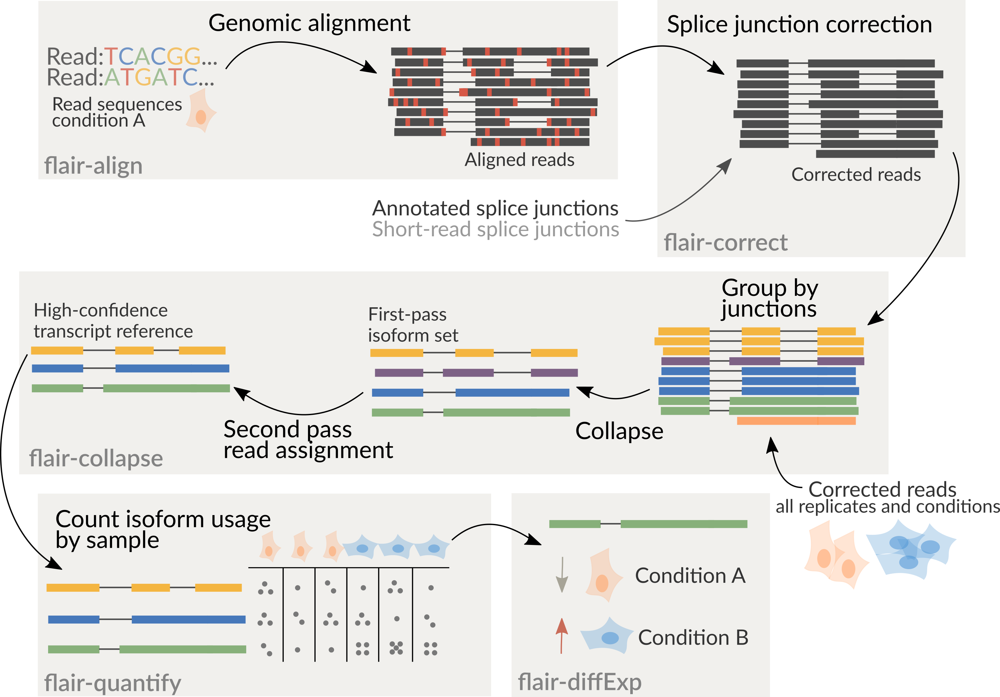

# number-25/LongTranscriptomics: Output

## Introduction

This document describes the output produced by the pipeline. Most of the plots are taken from the MultiQC report, which summarises results at the end of the pipeline.

Directories corresponding to the stages listed below will be created in the results directory after the pipeline has finished. All paths are relative to the top-level results directory.

## Pipeline overview

The pipeline is built using [Nextflow](https://www.nextflow.io/) and processes data using the following steps:

- [FASTQ quality control and summary stats](#FASTQ-quality-control)
  - [NANOQ](#NANOQ)
  - [SEQUALI](#SEQUALI)
- [Reference genome mapping](#Reference-genome-mapping)
  - [minimap2](#minimap2)
  - [samtools](#samtools-sort-index)
- [Create bigWig coverage files](#Create-files-to-visualise-mapping-coverage)
  - [bedtools](#bedtools)
  - [bedGraphToBigWig](#bedGraphToBigWig)
- [Extensive QC of alignments](#Alignment-quality-control)
  - [samtools](#samtools-flagstat)
  - [cramino](#cramino)
  - [alfred](#alfred)
  - [ngs-bits](#ngs-bits)
- [Transcriptome reconstruction](#Transcriptome-reconstruction)
  - [FLAIR](#FLAIR)
  - [bambu](#bambu)
  - [IsoQuant](#IsoQuant)
  - [StringTie](#StringTie)
  - [TranscriptToFasta](#Transcripts-FASTA)
  <!-- 7. Fusion gene detection [`JAFFA`](github.com/Oshlack/JAFFA) -->
- [Transcriptome assessment](#Transcriptome-assessment)
  - [gffcompare](#gffcompare)
- [Transcript quantification](#Transcript-quantification)
  - [oarfish](#oarfish)
- [Profile unmapped reads](#Profile-unmapped-reads)
  - [sylph](#sylph)
- [MultiQC](#multiqc) - Aggregate report describing results and QC from the whole pipeline
- [Pipeline information](#pipeline-information) - Report metrics generated during the workflow execution

## FASTQ quality control

### NANOQ

<details markdown="1">
<summary>Output files</summary>

- `fastq_qc/nanoq/`
  - `*_nanoq.json`: `json` formatted file containing quality metrics.
  - `*_nanoq_stats.txt`: basic NANOQ report containing quality metrics.
  - `*_nanoq_stats_verbose.txt`: verbose NANOQ report containing quality metrics.

</details>

[NANOQ](https://github.com/esteinig/nanoq) provides general quality statistics
about the nanopore sequence reads. It outputs the statistics in both verbose and
minimal reports, which can be formatted in `json` format.

```
Nanoq Read Summary
====================

Number of reads:      100000
Number of bases:      400398234
N50 read length:      5154
Longest read:         44888
Shortest read:        5
Mean read length:     4003
Median read length:   3256
Mean read quality:    NaN
Median read quality:  NaN


Read length thresholds (bp)

> 200       99104             99.1%
> 500       96406             96.4%
> 1000      90837             90.8%
> 2000      73579             73.6%
> 5000      25515             25.5%
> 10000     4987              05.0%
> 30000     47                00.0%
> 50000     0                 00.0%
> 100000    0                 00.0%
> 1000000   0                 00.0%


Top ranking read lengths (bp)

1. 44888
2. 40044
3. 37441
4. 36543
5. 35630
```

### SEQUALI

<details markdown="1">
<summary>Output files</summary>

- `fastq_qc/sequali/`
  - `*_sequali.json`: `json` formatted file containing quality metrics.
  - `*_sequali.html`: `html` formatted containing quality metrics.

</details>

[SEQUALI](https://github.com/rhpvorderman/sequali) provides general quality statistics
about the sequence reads, along with several other features including,
over-representation analysis and duplication rate estimation. It outputs the
statistics in both JSON and HTML format.

## Reference genome mapping

### minimap2

<details markdown="1">
<summary>Output files</summary>

- `mapping/`
  - `*_minimap2.sam`: the mapped output SAM file from minimap2.

</details>

[minimap2](https://github.com/lh3/minimap2) is perhaps the most popular
long-read sequence aligner. In general, it aligns the sequence reads to the reference
genome/transcriptome provided by the user. Taken directly from the developers

> Minimap2 is a versatile sequence alignment program that aligns DNA or mRNA
> sequences against a large reference database. Typical use cases include: (1)
> mapping PacBio or Oxford Nanopore genomic reads to the human genome; (2)
> finding overlaps between long reads with error rate up to ~15%; (3)
> splice-aware alignment of PacBio Iso-Seq or Nanopore cDNA or Direct RNA reads
> against a reference genome; (4) aligning Illumina single- or paired-end reads;
> (5) assembly-to-assembly alignment; (6) full-genome alignment between two
> closely related species with divergence below ~15%.

### samtools sort index

<details markdown="1">
<summary>Output files</summary>

- `mapping/`
  - `*_minimap2.bam`: the mapped output BAM file that has been sorted by samtools.
  - `*_minimap2.bam.bai`: the index of the mapped output BAM file.

</details>

[samtools](http://www.htslib.org/doc/#manual-pages) is a multipurpose
toolkit for working with SAM/BAM files. It is used to sort the output from
minimap2 (SAM format) and output it in compressed BAM format, and then index
this file.

## Create files to visualise mapping coverage

### bedtools

<details markdown="1">
<summary>Output files</summary>

- `mapping_visualisation/`
  - `*_+.bedGraph`: the intermediary bedgraph file from the positive (+) strand.
  - `*_+.bedGraph`: the intermediary bedgraph file from the negative (-) strand.

</details>

[bedtools](https://github.com/arq5x/bedtools2) is a multipurpose
toolkit for working with tab separated genomic formats such as GTF/GFF/BED, but
also SAM/BAM/CRAM files. Here it is used to convert the mapped BAM file to BEDGRAPH
format, in preparation for conversion to BigWig.

### bedGraphToBigWig

<details markdown="1">
<summary>Output files</summary>

- `mapping_visualisation/`
  - `*_+.bigWig`: the file bigWig file from the positive (+) strand.
  - `*_+.bigWig`: the file bigWig file from the negative (-) strand.

</details>

[bedGraphToBigWig](https://hgdownload.soe.ucsc.edu/admin/exe/) is a specific
tool that is part of a broad UCSC software suite. It has one specific
function that can be guessed from it's very name. You guessed it, it converts a
bedgraph to a BigWig file, that's it. Once created, the BigWig files can be
loaded into a genome browser such as IGV, allowing the mapping to be visualised
in a lightweight way. The bigWig format is an indexed binary format useful for
displaying dense, continuous data in Genome Browsers such as the UCSC and IGV.
This mitigates the need to load the much larger BAM file for data visualisation
purposes which will be slower and result in memory issues. The bigWig format is
also supported by various bioinformatics software for downstream processing
such as meta-profile plotting.

bigBed are more useful for displaying distribution of reads across exon
intervals as is typically observed for RNA-seq dat

## Alignment quality control

### samtools flagstat

<details markdown="1">
<summary>Output files</summary>

- `mapping_qc/samtools_flagstat/`
  - `*.flagstat.txt`: the output of samtools flagstat in txt format.
  </details>

[samtools](http://www.htslib.org/doc/#manual-pages) flagstats provides summary
statistics on the mapped BAM file. Specifically, it counts the number of
alignments for each FLAG type.

### cramino

<details markdown="1">
<summary>Output files</summary>

- `mapping_qc/cramino/`
  - `*_cramino.stats`: the output of cramino.

</details>

[cramino](https://github.com/wdecoster/cramino) is a tool for quick quality assessment of cram and bam files, intended for long read sequencing. It will output the statistics in a simple text file which is human readable.

```
File name       example.cram
Number of reads 14108020
% from total reads  83.45
Yield [Gb]      139.91
N50     17447
Median length   6743.00
Mean length     9917
Median identity 94.27
Mean identity   92.53
Path    alignment/example.cram
Creation time   09/09/2022 10:53:36
```

### alfred

<details markdown="1">
<summary>Output files</summary>

- `mapping_qc/alfred/`
  - `*_alfred.transposed.stats`: the transposed output of alfred.
  - `*_alfred.tsv.gz`: the output of alfred in gzipped tsv format.

</details>

[alfred](https://www.gear-genomics.com/docs/alfred/cli/) computes various
alignment metrics and summary statistics by read group. The transposed output is a transformation of the alignment metrics from column format to row format for readability. TSV output is gzipped by default.

### ngs-bits

<details markdown="1">
<summary>Output files</summary>

- `mapping_qc/ngs-bits/`
  - `*_ngsbits.qcML`: ngsbits summary file in XML format. Used as input to MultiQC.

</details>

[ngs-bits mappingQC](https://github.com/imgag/ngs-bits/blob/master/doc/tools/MappingQC/index.md)
provides one more technique for quality control of the mapped BAM files. It's
advantage is that it has an output that is compatible with
[MultiQC](https://github.com/MultiQC/MultiQC/blob/main/docs/markdown/modules/ngsbits.md). Outut comes formatted in XML format, so is not particularly human readable.

## Transcriptome reconstruction

### FLAIR

<details markdown="1">
<summary>Output files</summary>

- `transcript_reconstruction/flair/bam_to_bed/`
  - `*_.bed`: genome alignment that has been converted from BAM to BED format, to be used as input to FLAIR.
- `correct/`(optional)
  - `*_flair_correct_all_corrected.bed`: BED file of correct reads that is used in subsequent steps.
  - `*_flair_correct_all_inconsistent.bed`: BED file of rejected alignments.
  - `*_flair_correct_cannot_verify.bed`: BED file of unknown alignments, (only if the) chromosome is not found in annotation.
- `collapse/`
  - `*_collapsed_isoforms.bed`: BED file of high confidence isoforms.
  - `*_collapsed_isoforms.gtf`: as above but in GTF format.
  - `*_collapsed_isoforms.fa`: fasta sequences of high confidence isoforms.

</details>

[FLAIR](https://github.com/BrooksLabUCSC/flair) **F**ull **L**ength
**A**lternative **I**soform analysis of **R**NA is used for the correction,
isoform definition, and alternative splicing analysis of noisy reads. FLAIR has
primarily been used for nanopore cDNA, native RNA, and PacBio sequencing reads.
FLAIR is able to be used with and without read correction (splice site correction), making it amenable to
sensitive sample types, such as those coming from cancer where errors may
instead be putative variants which should not be corrected. FLAIR accepts a BED file as input, therefore, the aligned BAM file is always converted to BED format prior to input.



### bambu

<details markdown="1">
<summary>Output files</summary>

- `transcript_reconstruction/bambu/`
  - `counts_gene.txt`: gene level estimated counts.
  - `counts_transcript.txt`: transcript level estimated counts.
  - `extended_annotations.gtf`: contains all transcript models from the reference annotations and any novel high confidence transcript models (below NDR threshold).

</details>

[bambu](https://github.com/GoekeLab/bambu) provides reference-guided transcript discovery and quantification for long read RNA-Seq data. It performs very slight splice site correction, and is currently the most widely used long-read transcript reconstruction software in the field.

### IsoQuant

<details markdown="1">
<summary>Output files</summary>

- `transcript_reconstruction/isoquant/`
  - `*_isoquant.corrected_reads.bed.gz`: BED file with corrected read alignments (gzipped by default).
  - `*_isoquant.discovered_gene_counts.tsv`: raw read counts for discovered genes (corresponds to SAMPLE_ID.transcript_models.gtf).
  - `*_isoquant.discovered_gene_tpm.tsv`: expression of discovered genes in TPM (corresponds to SAMPLE_ID.transcript_models.gtf).
  - `*_isoquant.discovered_transcript_counts.tsv`: raw read counts for discovered transcript models (corresponds to SAMPLE_ID.transcript_models.gtf).
  - `*_isoquant.discovered_transcript_tpm.tsv`: expression of discovered transcripts models in TPM (corresponds to SAMPLE_ID.transcript_models.gtf).
  - `*_isoquant.extended_annotation.gtf`: GTF file with the entire reference annotation plus all discovered novel transcripts.
  - `*_isoquant.gene_counts.tsv`: TSV file with raw read counts for reference genes.
  - `*_isoquant.gene_tpm.tsv`: TSV file with reference gene expression in TPM.
  - `*_isoquant.transcript_counts.tsv`: TSV file with raw read counts for reference transcript.
  - `*_isoquant.transcript_tpm.tsv`: TSV file with reference transcript expression in TPM.
  - `*_isoquant.read_assignments.tsv.gz`: TSV file with read to isoform assignments (gzipped by default).
  - `*_isoquant.transcript_model_reads.tsv.gz`: TSV file indicating which reads contributed to transcript models (gzipped by default).
  - `*_isoquant.transcript_models.gtf`: GTF file with discovered expressed transcript (both known and novel transcripts).

</details>

[IsoQuant](https://github.com/ablab/IsoQuant) is a tool for the genome-based analysis of long RNA
reads, such as PacBio or Oxford Nanopores. IsoQuant allows to reconstruct and
quantify transcript models with high precision and decent recall. If the
reference annotation is given, IsoQuant also assigns reads to the annotated
isoforms based on their intron and exon structure. IsoQuant further performs
annotated gene, isoform, exon and intron quantification. If reads are grouped
(e.g. according to cell type), counts are reported according to the provided
grouping. IsoQuant, like FLAIR, provides optional read correction capabilities, which should be used accordingly.

### StringTie

<details markdown="1">
<summary>Output files</summary>

- `transcript_reconstruction/stringtie/`
  - `*_stringtie.transcripts.gtf`: main output GTF file containing the assembled transcripts.
  - `*_stringtie.coverage.gtf`: fully covered transcripts that match the reference annotation, in GTF format.

[StringTie](ccb.jhu.edu/software/stringtie/) is a fast and highly
efficient assembler of RNA-Seq alignments into potential transcripts. It uses a
novel network flow algorithm as well as an optional de novo assembly step to
assemble and quantitate full-length transcripts representing multiple splice
variants for each gene locus. StringTie does not perform read correction.
i

</details>

### Transcripts FASTA

<details markdown="1">
<summary>Output files</summary>

- `transcript_reconstruction/transcripts_fasta/`
  - `*_bambu_transcripts.fa`: FASTA sequences of all assembled transcripts from bambu.
  - `*_isoquant_transcripts.fa`: FASTA sequences of all assembled transcripts from isoquant.
  - `*_stringtie_transcripts.fa`: FASTA sequences of all assembled transcripts from stringtie.

</details>

This is a straight forward module which simply converts the
reconstruction/assembled transcripts from the various software into their FASTA
sequences. If using FLAIR, the transcript sequences in FASTA format will be
created by the tool itself.

## Transcriptome assessment

### gffcompare

<details markdown="1">
<summary>Output files</summary>

- `transcriptome_assessment/{flair,isoquant,bambu,stringtie}/`
  - `*_{flair,isoquant,bambu,stringtie}.annotated.gtf`: input transcriptome GTF file annotated with the reference transcriptome provided.
  - `*_{flair,isoquant,bambu,stringtie}.gtf.refmap`: this tab-delimited file lists, for each reference transcript, which query transcript either fully or partially matches that reference transcript.
  - `*_{flair,isoquant,bambu,stringtie}.gtf.tmap`: this tab delimited file lists the most closely matching reference transcript for each query transcript.
  - `*_{flair,isoquant,bambu,stringtie}.stats`: in this output file Gffcompare reports various statistics related to the “accuracy” (or a measure of agreement) of the input transcripts when compared to reference annotation data. These accuracy measures are calculated under the assumption that the input GFF/GTF file(s) (the "query" transcripts, or transfrags, from one or multiple "samples") are coming from some transcript discovery/assembly pipeline (e.g. Cufflinks or StringTie), or from any other gene/transcript prediction pipeline. GffCompare can be used to assess the accuracy of such pipelines, when comparing their results to a known reference annotation
  - `*_{flair,isoquant,bambu,stringtie}.tracking`: this file matches transcripts up between samples. This file matches transcripts up between samples. Each row represents a transcript structure that is preserved (structurally equivalent) across all the input GTF files. GffCompare considers transcripts "matching" (i.e. structurally equivalent) if all their introns are identical. Note that "matching" transcripts are allowed to differ on the length of the first and last exons, since these lengths can usually vary across samples for the same biological transcript.

</details>

[gffcompare](https://ccb.jhu.edu/software/stringtie/gff.shtml#gffcompare) can be used to compare, merge, annotate and estimate accuracy of one or more GFF files (the "query" files), when compared with a
reference annotation (also provided as GFF/GTF).

```
#= Summary for dataset: stringtie_asm.gtf
#     Query mRNAs :   23555 in   17628 loci  (17231 multi-exon transcripts)
#            (3731 multi-transcript loci, ~1.3 transcripts per locus)
# Reference mRNAs :   16628 in   12062 loci  (15850 multi-exon)
# Super-loci w/ reference transcripts:    11552
#-----------------| Sensitivity | Precision  |
        Base level:    82.4     |    76.5    |
        Exon level:    81.2     |    82.9    |
      Intron level:    86.1     |    94.8    |
Intron chain level:    56.9     |    52.4    |
  Transcript level:    55.2     |    38.9    |
       Locus level:    70.1     |    48.0    |
```

## Transcript quantification

### Oarfish

<details markdown="1">
<summary>Output files</summary>

- `transcript_quantification/oarfish/`
  - `*.quant.gz`: a tab separated file listing the quantified targets, as well as information about their length and other metadata. The num_reads column provides the estimate of the number of reads originating from each target.
  - `*.meta_info.json`: a JSON format file containing information about relevant parameters with which oarfish was run, and other relevant inforamtion from the processed sample apart from the actual transcript quantifications.

</details>

[oarfish](https://github.com/COMBINE-lab/oarfish) is a program for quantifying
transcript-level expression from long-read (i.e. Oxford nanopore cDNA and
direct RNA and PacBio) sequencing technologies. oarfish requires a sample of
sequencing reads aligned to the transcriptome (currently not to the genome). It
handles multi-mapping reads through the use of probabilistic allocation via an
expectation-maximization (EM) algorithm.

## Profile unmapped reads

### Sylph

<details markdown="1">
<summary>Output files</summary>

- `profile_unmapped_reads/sylph`
  - `*.tsv`: Sylph outputs a TSV (tab-separated values) file. Each row is one genome detected in the metagenome sample.
  - `*.sylph_tax.sylphmpa`: sylph-tax can turn sylph's TSV output into a taxonomic profile like Kraken or MetaPhlAn. sylph-tax does this by using custom taxonomy files to annotate sylph's output.

</details>

## MultiQC

[MultiQC](http://multiqc.info) is a visualization tool that generates a single HTML report summarising all samples in your project. Most of the pipeline QC results are visualised in the report and further statistics are available in the report data directory.

Results generated by MultiQC collate pipeline QC from supported tools e.g. FastQC. The pipeline has special steps which also allow the software versions to be reported in the MultiQC output for future traceability. For more information about how to use MultiQC reports, see <http://multiqc.info>.

## Pipeline information

<details markdown="1">
<summary>Output files</summary>

- `pipeline_info/`
  - Reports generated by Nextflow: `execution_report.html`, `execution_timeline.html`, `execution_trace.txt` and `pipeline_dag.dot`/`pipeline_dag.svg`.
  - Reports generated by the pipeline: `pipeline_report.html`, `pipeline_report.txt` and `software_versions.yml`. The `pipeline_report*` files will only be present if the `--email` / `--email_on_fail` parameter's are used when running the pipeline.
  - Reformatted samplesheet files used as input to the pipeline: `samplesheet.valid.csv`.
  - Parameters used by the pipeline run: `params.json`.

</details>

[Nextflow](https://www.nextflow.io/docs/latest/tracing.html) provides excellent functionality for generating various reports relevant to the running and execution of the pipeline. This will allow you to troubleshoot errors with the running of the pipeline, and also provide you with other information such as launch commands, run times and resource usage.
